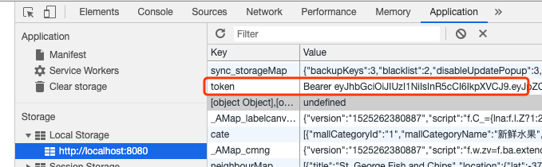

## 后台管理页面搭建

我们后台管理的前端页面使用 @vue/cli 脚手架工具搭建，版本 3.8.3 ，如果你本地仍旧是 2+ 版本的 vue-cli，可以根据下面方法来升级到 3+ 版本。

### 升级 vue-cli

本地 vue-cli 升级到最新 3.0+ 的 @vue/cli

```shell
npm uninstall -g vue-cli 卸载旧版
npm install -g @vue/cli 安装新版
vue -V 查看版本
```

### 准备工作

#### 创建项目

```shell
# 通过 create 创建
vue create client
# 选择手动配置
? Please pick a preset: (Use arrow keys)
  default (babel, eslint)
❯ Manually select features
# 勾选如下配置（空格键进行勾选或取消）
? Check the features needed for your project:
 ◉ Babel
 ◯ TypeScript
 ◯ Progressive Web App (PWA) Support
 ◉ Router
 ◉ Vuex
 ◉ CSS Pre-processors
❯◉ Linter / Formatter
 ◯ Unit Testing
 ◯ E2E Testing
# 选择 history 模式
? Use history mode for router? (Requires proper server setup for index fallback in
 production) (Y/n) y
# 本项目采用 Stylus 预处理器
? Pick a CSS pre-processor (PostCSS, Autoprefixer and CSS Modules are supported by
 default):
  Sass/SCSS (with dart-sass)
  Sass/SCSS (with node-sass)
  Less
❯ Stylus
 # 选择 Standard 代码风格检查器
? Pick a linter / formatter config:
  ESLint with error prevention only
  ESLint + Airbnb config
❯ ESLint + Standard config
  ESLint + Prettier
# 询问在什么时候校验代码风格(1保存时，2提交时)【选1】
? Pick additional lint features: (Press <space> to select, <a> to toggle all, <i>
to invert selection)
❯◉ Lint on save
 ◯ Lint and fix on commit
# 把上面配置保存在单独文件还是融入package.json【选1，单独保存】
? Where do you prefer placing config for Babel, PostCSS, ESLint, etc.? (Use arrow keys)
❯ In dedicated config files
  In package.json
# 是否把本次项目配置保存起来当做今后的可选配置【选否】
? Where do you prefer placing config for Babel, PostCSS, ESLint, etc.? In dedicate
d config files
? Save this as a preset for future projects? (y/N) n
```

当你看到类似下面的提示，就表明你项目初始换完成：

```shell
🎉  Successfully created project client.
👉  Get started with the following commands:

 $ cd client
 $ npm run serve
```

#### 移除不需要的内容

1. 移除 `src/assets/` 下的 `logo.png`
2. 移除 `src/components/` 下的 `HelloWorld.vue`
3. 移除 `src/views/` 下的 `Home.vue` 以及 `About.vue`
4. 删除 `src/router.js` 中和 `Home.vue` 以及 `About.vue` 有关的代码
5. 删除 `src/App.vue` 中和 `Home.vue` 以及 `About.vue` 有关的代码；同时移除样式中 `#nav` 相关的代码

#### 添加需要的内容

1.在 `src/views/` 下新建 `Index/vue` 文件：

  ```js
  <template>
    <div class="index">
      <h1>{{msg}}</h1>
    </div>
  </template>

  <script>
    export default {
      name: 'index',
      data() {
        return {
          msg: 'Hello Element'
        }
      },
    }
  </script>

  <style lang="stylus" scoped>

  </style>
  ```

2.在 `src/router.js` 中引入 `Index.vue`：

  ```js
  import Index from './views/Index.vue'
  ...
  routes: [
    { path: '/', redirect: '/index' },
    { path: '/index', name: 'index', component: Index }
  ]
  ```

3.`src/App.vue` 中的样式更改为：

  ```css
  <style lang="stylus">
  html,
  body,
  #app
    font-family 'Avenir', Helvetica, Arial, sans-serif
    -webkit-font-smoothing antialiased
    -moz-osx-font-smoothing grayscale
    width 100%
    height 100%
  </style>
  ```

4.在 `public/` 下新建css文件夹，并创建 `reset.css` 文件，该文件具体内容可在 `https://cdnjs.cloudflare.com/ajax/libs/meyer-reset/2.0/reset.css` 中全选复制过来，最后在底部添加上我们自己定义的一些样式类：

  ```css
  ...
  /* 自定义样式 */
  .el-loading {
    position: absolute;
    z-index: 2000;
    background-color: rgba(255, 255, 255, .7);
    margin: 0;
    top: 0;
    right: 0;
    bottom: 0;
    left: 0;
    -webkit-transition: opacity .3s;
    transition: opacity .3s;
  }

  .el-loading-spinner {
    top: 50%;
    margin-top: -21px;
    width: 100%;
    text-align: center;
    position: absolute;
  }

  .el-input__prefix {
    color: black !important;
  }

  a {
    text-decoration: none;
    color: black;
  }
  ```

现在打开浏览器访问 `http://localhost:8080/` ，它应该能正常工作并显示「Hello Element」字样。

### 按需引入 element-ui

安装 element-ui 以及 babel-plugin-component：

```shell
npm i element-ui
```

```shell
npm install babel-plugin-component -D
```

然后修改 `Babel.config.js` 文件：

```js
module.exports = {
  presets: [
    '@vue/app'
  ],
  plugins: [
    [
      'component',
      {
        libraryName: 'element-ui',
        styleLibraryName: 'theme-chalk'
      }
    ]
  ]
}
```

接下来在入口文件 `main.js` 中引入需要用到的组件：

```js
import { Button, Select } from 'element-ui'
import 'element-ui/lib/theme-chalk/index.css'
Vue.use(Button).use(Select)
```

你可以在 `src/views/Index.vue` 中添加 `<el-button type="primary">主要按钮</el-button>` 来验证是否能够正常使用 element-ui 组件。

### 封装 axios

```shell
npm i axios
```

`src` 下新建 `api` 文件夹，并在其下创建 `request.js` 用来封装 axios ：

```js
import axios from 'axios'

const ERR_OK = 0 // 错误码

export function request(url, method = 'get') {
  return function (params = {}) {
    return axios[method](url, params).then(res => {
      const { code, data } = res.data
      if (code === ERR_OK) return data
    }).catch(err => {
      return Promise.reject(err)
    })
  }
}
```

然后在 `src/api/` 下新建 index.js 文件用来封装API接口：

```js
import { request } from './request'
const POST = 'post'

const postLogin = request('/admin/login', POST)

export {
  postLogin
}
```

完成上述两步后，你便可以在组件中通过引入 `src/api/index.js` 来调用封装好的接口：

```js
// 请求登录
postLogin({这里是post请求参数}).then(data => {
  // 登录成功后的逻辑代码
}).catch(err => {
  // 出现错误后的逻辑代码
})
```

### 前端配置跨域代理

我们知道浏览器有同源策略，目前前端地址为 `127.0.0.1:8080` ，后端接口地址为 `127.0.0.1:7001` ，所以一旦前端发送请求肯定会出现跨域问题，通常情况下需要在后端设置 `Access-Control-Allow-Origin: *` ，但这次我们通过在前端配置代理的方式解决跨域问题。

我们在 `client` 文件夹下创建 `vue.config.js` 文件，并在其中编写代码：

```js
module.exports = {
  publicPath: '/', // 根域上下文目录
  outputDir: 'dist', // 构建输出目录
  assetsDir: 'assets', // 静态资源目录 (js, css, img, fonts)
  devServer: {
    proxy: { // 配置跨域
      '/admin': {
        target: 'http://127.0.0.1:7001/admin/',
        ws: true,
        changOrigin: true,
        pathRewrite: {
          '^/admin': ''
        }
      }
    },
    before: app => {}
  }
}
```

配置完成后重启服务，就能解决跨域问题了。例如我们在 `src/api/index.js` 中编写的这句代码：

```js
const postLogin = request('/admin/login', POST)
```

就能够正常访问到后端接口 `127.0.0.1:7001/admin/login` 。

p.s. 如果你对上面的配置感到困惑，可以[在此](https://cli.vuejs.org/zh/config/#devserver-proxy)查看 Vue CLI 官方对 devServer.proxy 的解释说明。

### axios 请求拦截

为了更好的用户体验，我们最好能够在发起请求时有个 loading 动画，请求出错时有个消息提醒。为了实现这两个功能，我们可以借助 axios 的请求拦截来完成。

在 `src/api/` 文件下新建 http.js 文件：

```js
import axios from 'axios'
import { Message, Loading } from 'element-ui'

let loading

// 请求拦截  设置统一header
axios.interceptors.request.use(config => {
  // 加载
  startLoading()
  return config
}, error => {
  return Promise.reject(error)
})

// 响应拦截
axios.interceptors.response.use(response => {
  endLoading()
  return response
}, error => {
  // 错误提醒
  endLoading()
  Message.error(error.response.data.message)
  return Promise.reject(error)
})

// 使用 element-ui 的 Loading 组件方法
function startLoading() {
  loading = Loading.service({
    lock: true,
    text: '加载中...',
    background: 'rgba(0, 0, 0, .7)'
  })
}

function endLoading() {
  loading.close()
}

export default axios
```

最后我们再把 axios 挂载到 Vue 当中去：

> client/src/main.js

```js
import axios from './api/http'
Vue.prototype.$axios = axios
```

### 404页面

404页面非常简单，「一张居中图片+返回首页的导航」就能搞定，所以就不展示代码了，可以自行在 `src/views/404.vue` 页面中查看。

p.s. 404页面的图片存放在 `src/assets/404.png`，选自 github 上超火的一个后台前端框架解决方案项目 [vue-element-admin](https://github.com/PanJiaChen/vue-element-admin) ，有兴趣的小伙伴可以前去围观~

### 登录页面

首先创建文件：`src/views/Login.vue`，初始化页面代码。具体的布局和样式就不多说了，自行在该文件中查看。这里挑几个重点说一下：

1. `el-form` 表单中有两个属性「:model="loginUser" :rules="rules"」，第一个是用来绑定要提交的数据的，loginUser中存储着「邮箱」和「密码」字段，便于在最终提交时获取到用户输入的内容。而rules则是表单验证规则，例如规定邮箱输入框只能填写邮箱，非邮箱会导致警告。
2. 登录按钮绑定了 `login` 函数，并传递了 `loginForm` 字符串，这是为了让 element 知道该验证哪个表单中的字段。

接下来的重点是点击登录按钮后触发的login方法：

```js
login(formName) {
  // 首先根据 rules 验证表单是否全部通过
  this.$refs[formName].validate(valid => {
    if (valid) {
      // 验证通过则发起login请求
      postLogin(this.loginUser).then(data => {
        // 登录成功将 token 存储到 localStorage 并跳转到首页
        const { token } = data
        localStorage.setItem('token', token)
        // 跳转到 index
        this.$router.push('/index')
      }).catch(() => {})
    }
  })
}
```

### 路由守卫

现在有个问题，如果我们在未登录情况下访问首页，应该需要跳转到登录页而不是直接显示首页。这个功能的实现可以利用 Vue Router 的路由守卫。我们来到 `src/router.js` 中，将代码修改为如下形式：

```js
// 使用 router 变量接收
const router = new Router({
  ...
  ]
})

// 路由守卫
router.beforeEach((to, from, next) => {
  // 查看本地是否有 token 值
  const isLogin = localStorage.token
  if (to.path === '/login') {
    next()
  } else {
    // 访问非login页面检查 isLogin ，不存在则跳转 login
    isLogin ? next() : next('/login')
  }
})

// 导出
export default router
```

现在我们在未登录情况下访问 index 页面，就会被强制跳转到 login 页面了。

### 再次编辑 axios 请求拦截

我们不久前编写过 axios 的请求拦截，为的是在请求前添加loading动画和请求错误时的消息提醒。这次我们仍然需要继续操作 `src/api/http.js` 。目的是在请求非登录页面时带上 token 凭证，在接收到服务器响应时验证 token 值是否有效（因为 token 有有效期，还记得之前在后端生成 token 时设置过一个过期字段 expiresIn 嘛~）。

```js
// 别忘了引入 router !!!
import router from '../router'

// 请求拦截  设置统一header
axios.interceptors.request.use(config => {
  // 加载
  startLoading()

  if (localStorage.token) {
    // 设置统一的请求 header
    config.headers.Authorization = localStorage.token
  }
  return config
}, error => {
  return Promise.reject(error)
})

// 响应拦截  401 token过期处理
axios.interceptors.response.use(response => {
  endLoading()
  return response
}, error => {
  // 错误提醒
  endLoading()

  const { status } = error.response
  // 状态码401代表token失效
  if (status === 401) {
    Message.error('token值无效，请重新登录')
    // 清除token
    localStorage.removeItem('token')
    // 跳转登录页面
    router.push('/login')
  } else { // 其他错误
      Message.error(error.response.data.message)
  }

  return Promise.reject(error)
})
```

### 解析 token 并存储到 Vuex

#### 解析 token

首先安装能够解析 token 的模块：

```shell
npm i jwt-decode
```

然后在 `src/views/Login.vue` 中引入：

```js
import jwtDecode from 'jwt-decode'
```

并在 Login 方法中解析：

```js
login(formName) {
  this.$refs[formName].validate(valid => {
    if (valid) {
      postLogin(this.loginUser).then(data => {
        // 登录成功
        const { token } = data
        localStorage.setItem('token', token)
        // 解析token
        const decode = jwtDecode(token)
        this.$router.push('/index')
      }).catch(() => {})
    }
  })
}
```

#### 存储到 Vuex

来到我们的 `src/store.js` 文件，修改为如下代码：

```js
import Vue from 'vue'
import Vuex from 'vuex'

Vue.use(Vuex)

const types = {
  SET_IS_AUTHENTICATED: 'SET_IS_AUTHENTICATED', // 是否认证通过
  SET_USER: 'SET_USER' // 用户信息
}

// 定义状态
const state = {
  isAuthenticated: false, // 是否认证
  user: {} // 用户信息
}

// 获取状态
const getters = {
  isAuthenticated: state => state.isAuthenticated,
  user: state => state.user
}

// 设置状态
const mutations = {
  [types.SET_IS_AUTHENTICATED](state, isAuthenticated) {
    // 如果调用该方法传递的认证结果为真，则设置 isAuthenticated 为true，否则为false
    state.isAuthenticated = isAuthenticated
  },

  [types.SET_USER](state, user) {
    state.user = user || {}
  }
}

// 异步调用更改状态的 mutations
const actions = {
  setAuthenticated({ commit }, isAuthenticated) {
    commit(types.SET_IS_AUTHENTICATED, isAuthenticated)
  },

  setUser({ commit }, user) {
    commit(types.SET_USER, user)
  }
}

export default new Vuex.Store({
  state,
  getters,
  mutations,
  actions
})
```

配置完 Vuex 后我们转到 `src/views/Login.vue` 页面，在登录成功后设置 state 的两个状态：

```js
login(formName) {
  this.$refs[formName].validate(valid => {
    if (valid) {
      postLogin(this.loginUser).then(data => {
        // 登录成功
        const { token } = data
        localStorage.setItem('token', token)
        // 解析token
        const decode = jwtDecode(token)
        // 存储数据到Vuex
        this.$store.dispatch('setAuthenticated', !this.isEmpty(decode))
        this.$store.dispatch('setUser', decode)
        // 页面跳转
        this.$router.push('/index')
      }).catch(() => {})
    }
  })
},
// 验证decode是否为空
isEmpty(value) {
  return (
    value === undefined ||
    value === null ||
    (typeof value === 'object' && Object.keys(value).length === 0) ||
    (typeof value === 'string' && value.trim().length === 0)
  )
}
```

我们来测试一下，首先打开 chrome 开发者工具，选中 Application 找到左侧的 Local Storage 一栏，找到 localhost:8080 中的 token ，删除它：



然后回到 login ，打开 Vue.js devtools ，会发现此时 state 状态为：


接着我们输入管理员邮箱和密码登录，就会发现 state 状态已经改变——认证状态为 true，且获取到了 user 信息。

但此时还有个 bug ，当你刷新浏览器后，会发现 state 又变为初始状态都为空了，这是因为 js 代码是运行在内存中的，代码运行时的所有变量、函数也都是保存在内存中的。一旦刷新页面，以前申请的内存被释放，重新加载脚本代码，变量重新赋值，这才导致 state 被清空。为了解决这个问题，我们还需要在 `src/App.vue` 根组件中对 localStorage 中是否存在 token 进行一个判断，如果有则保存到 Vuex 中：

```js
import jwtDecode from 'jwt-decode'

export default {
  name: 'app',
  created() {
    if (localStorage.token) {
      const decode = jwtDecode(localStorage.token)
      this.$store.dispatch('setAuthenticated', !this.isEmpty(decode))
      this.$store.dispatch('setUser', decode)
    }
  },
  methods: {
    isEmpty(value) {
      return (
        value === undefined ||
        value === null ||
        (typeof value === 'object' && Object.keys(value).length === 0) ||
        (typeof value === 'string' && value.trim().length === 0)
      )
    }
  }
}
```

现在再重复刚才的测试，就会发现 state 中的状态不会被清空了。

p.s. 由于两处地方都用到了 `isEmpty` 方法，所以最后把它封装到了 `src/utils/index.js` 中。

### 搭建首页

首页整体分为左右结构。左侧菜单栏；右边分上下两部分，顶部头部导航，其余部分是主体页面，最终效果如下所示：

TODO: 此处放最终截图

`src/views/Index.vue` 骨架搭建：

```html
<el-container class="index" style="height: 100%; border: 1px solid #eee">
  <!-- 侧边栏（:collapse="isFold"控制折叠） -->
  <left-menu :isFold="isFold"></left-menu>
  <!-- 右侧部分 -->
  <el-container class="right-wrapper">
    <!-- 顶部导航栏 -->
    <el-header class="header">
      <!-- 显示或隐藏侧边栏按钮 -->
      <head-nav @headNavFold="swFold"></head-nav>
    </el-header>
    <!-- 主体 -->
    <el-main class="main-wrapper">
      <router-view></router-view>
    </el-main>
  </el-container>
</el-container>
```

上面仅仅是为了便于理解展示的html部分，具体js和css代码还是需要查看 `src/views/Index.vue` 。

#### 搭建顶部导航栏

为了方便管理，我们把首页的顶部导航栏拆成一个独立的组件来写，它存放在 `src/components/HeadNav.vue` ，由于代码量还挺大，这里仅挑几条重要的说：

- 顶部导航栏结构
  - 左侧按钮（用来显示或隐藏侧边菜单栏）
  - 右侧用户信息（用来展示管理员头像、昵称，以及登出）

- 与父组件的交互
  - 骨架页面（也就是首页Index）有个点击顶部「左侧按钮」能够显示或隐藏右侧「侧边栏」的功能。又由于「左侧按钮」在子组件顶部导航栏中，所以我们需要通过 `this.$emit()` 的方式告知父组件管理员点击了「左侧按钮」，具体方法是：

    1. 子组件给「左侧按钮」绑定click事件 `triggerAside`
    2. `triggerAside` 方法中调用 `this.$emit('headNavFold', this.isFold)` 来通知父组件显示/隐藏侧边栏
    3. 父组件使用 `swFold` 方法来接收广播，从而改变 `isFold` 的值来触发侧边栏的显示隐藏。

#### 搭建侧边栏

侧边栏非常简单，无非几个菜单选项而已，页面在 `src/components/LeftMenu.vue` ，所以这里不详细讲解了，配合[官网文档](https://element.eleme.cn/#/zh-CN/component/menu)体验更佳~

#### 搭建柱状图

首页的 Dashboard 中包含一个显示各分类下商品数量的柱状图，我们采用 Echartsjs 来完成此功能。

首先下载 eachrts：

```shell
npm i echarts
```

接着在 `src/main.js` 中按需引入：

```js
// 按需引入 echartsjs
const echarts = require('echarts/lib/echarts')
// 引入柱状图等组件
require('echarts/lib/chart/bar')
require('echarts/lib/component/tooltip')
require('echarts/lib/component/title')
require('echarts/lib/component/legend')
require('echarts/lib/component/legendScroll') // 图例滚动
Vue.prototype.$echarts = echarts
```

然后在 `src/components` 下新建 `BarChart.vue` 组件，该组件接收 `class id height width top10` 这样几个参数，其中 top10 属性接收父组件传递过来的商品销量前10的商品信息数组，然后使用 `watch` 监听 top10 ，一旦top10的值发生变化，就证明父组件已经传递过来了获取到的数据，然后将其赋值给 echart 柱状图组件实现可视化展示。

最后新建 `src/views/Dashboard.vue` 页面，并在其中引入 `src/components/BarChart.vue` 组件即可，具体代码去两个文件中查看吧。

### 搭建个人信息页面

这个页面相比侧边栏更加简单，布局和样式就不展开了，该页面路径为 `src/views/UserInfo.vue` 。

唯一需要说明的是，我们需要把它的路由配置放在 `index` 中当做子路由：

```js
import UserInfo from './views/UserInfo.vue'
...
{ path: '/index',
  name: 'index',
  component: Index,
  children: [
    { path: '/userinfo', name: 'userinfo', component: UserInfo }
  ]
},
```

### 商品一级分类的增删改查

首先在 `src/views` 下新建 `CategoryList.vue` 文件，该组件的页面结构分为三部分：

- 添加分类按钮
- 一级分类表格
- 默认隐藏着的编辑页面（element的dialog组件）

具体代码不在这儿重复展示，直接移步 `src/views/CategoryList.vue` 查看即可。

着重说明的是编辑页面是个单独的组件，放在了 `src/components/SWDialog.vue` 中，这是因为它不单单只负责编辑，添加的业务逻辑也会在该组件中处理，代码较多，为了更方便维护所以做成了组件。

该组件接收两个 prop ：

- options
  - show 控制dialog的显示隐藏
  - title 控制dialog左上角的标题显示「添加」/「编辑」
  - type 控制dialog成为「添加」/「编辑」模式
- form
  - 如果用户点击的添加按钮，则表单字段都为空，不用传
  - 如果用户点击的编辑按钮，则表单拿到当前列的所有字段，传给dialog进行数据展示

另外一点需要说明的是上传功能的代码，这部分代码与普通的POST请求传递数据不同，我们需要使用 FormData 来处理：

```js
// 上传图片
uploadImg() {
  return new Promise((resolve, reject) => {
    // 创建form对象
    let formData = new FormData()
    // 对应后台接收图片名
    formData.append('imgFile', this.fileList[0])
    // 指明表单数据有文件数据
    let config = {
      headers: {
        'Content-Type': 'multipart/form-data'
      }
    }
    uploadImg(formData, config).then(data => {
      this.fileList = []
      this.formData.IMAGE = data
      resolve()
    }).catch((err) => reject(new Error(err)))
  })
}
```

TODO: 如果想要查看后端如何实现上传的接口，可以点击[此处了解]()

#### 权限管理

该后台管理系统的管理人员分为『超管』和『员工』两种角色，其中只有『超管』才能对商城的一级分类执行增删改操作，而『员工』是没有权限的，所以本页面还对当前用户身份进行了判断，如果身份为『员工』，则禁用所有按钮。

### 商品详情列表页搭建

该页面与商品一级分类的列表页大同小异，无非增加了两个功能：「分页」和「筛选」。具体页面见：

- `src/views/GoodsList.vue`
- `src/components/StandardPagination.vue` element分页控件的封装
- `src/components/CategorySelect.vue` element下拉菜单select控件的封装
  - 该组件有两个监听事件（cateloaded 与 catechange，分别在商品分类请求完成，和用户改变了下拉菜单值的时候改变，这样父组件的筛选事件被触发时就能获取到最新的二级分类id）

### 商品详情编辑/添加页搭建

在 `src/views/` 下新建 `GoodsDetail.vue` 页面，该页面用来处理商品详情的编辑与添加事务。

具体代码就不粘贴了，说几个重要的点：

#### 如何判断当前页是编辑页还是添加页

在 `GoodsDetail` 中声明一个变量 `type` 用来记录当前是在进行添加商品操作还是编辑商品操作，判定的依据就是 `$router.params.ID` 。如果是从商品列表页中的「编辑」按钮过来的，则路由类似于 `http://localhost:8080/goodsdetail/a8a14ebf433c4e46b627c7d5233a5f4e` ，这一长串字符串“a8a14ebf433c4e46b627c7d5233a5f4e”便是某个商品的ID，此时type为edit；如果是 `http://localhost:8080/goodsdetail/add` 这样的形式，则代表从商品列表页点击「添加」按钮而来，此时type为add。

#### el-date-picker 组件的时间问题

默认情况下 el-date-picker 组件的默认时间为国际标准时间，而后端传递过来的商品的两个字段 「CREATE_TIME」和「UPDATE_TIME」则是北京时间，这两者之间相差了8个小时，如果不进行任何设置，你会发现选择的明明是当前时间，一旦更新或添加商品时，对应的时间自动就少了8小时，所以需要进行统一转换，我们把转换方法封装进 `src/utils/index.js` 中去：

```js
/**
 * UTC转GMT+8
 * @param {string} time
 * @return {string} date
 */
export function eosFormatTime(time) {
  const dt = new Date(time)
  const date = [
    [dt.getFullYear(), dt.getMonth() + 1, dt.getDate()].join('-'),
    [dt.getHours(), dt.getMinutes(), dt.getSeconds()].join(':')
  ].join(' ').replace(/(?=\b\d\b)/g, '0')
  return date
  // 👇GMT转UTC👇
  // new Date("2019-06-27 00:00:00").toISOString()
  // log 2019-06-26T16:00:00.000Z
}
```

然后在 `src/views/GoodsDetail.vue` 中调用：

```js
import { eosFormatTime } from '../utils'

...

this.detailForm.CREATE_TIME = eosFormatTime(this.detailForm.CREATE_TIME)
```

除此之外，还得给 el-date-picker 控件设置一个属性 value-format ，这样在表单提交的时候就会以你 value-format 的格式提交：

```js
<el-date-picker
  v-model="detailForm.CREATE_TIME"
  type="datetime"
  format="yyyy-MM-dd HH:mm:ss"
  value-format="yyyy-MM-dd HH:mm:ss"
  placeholder="选择日期时间">
```

#### 富文本编辑器 TinyMCE

以前用 .NET 写后台的时候，富文本编辑器用的是百度的 UEditor ，不过那个界面真的太丑了，算得上是上古时期的了，正好在 Github 上 Star 过 [vue-element-admin](https://github.com/PanJiaChen/vue-element-admin) ，就去查了下，发现作者选择了一款叫做 [TinyMCE](https://github.com/tinymce/tinymce) 的富文本编辑器，觉得还不错，就直接套用了。

首先进行安装：

```shell
npm i @tinymce/tinymce-vue tinymce
```

然后下载中文语言包：

https://www.tiny.cloud/get-tiny/language-packages/

查找列表中的「Chinese (China)	」 点击 Download 下载。

接着在 `client/public/` 目录下新建 tinymce 文件夹，然后新建 `langs` 文件夹把刚才下载的 `zh-CN.js` 中文语言包扔进去；另外在 `client/node_modules/` 中找到 `tinymce`，把 `skins` 目录复制到 `client/public/tinymce` 中，最终目录结构如下：

```shell
tinymce
├── langs
│   └── zh_CN.js
└── skins
    └── ui
        ├── oxide
        └── oxide-dark
```

完成安装工作后就可以开始封装组件了，组件封装地址 `src/components/TinymceEditor.vue` ，代码如下：

```js
<template>
  <div class="tinymce-editor">
    <editor v-model="myValue"
      :init="init"
      :disabled="disabled"
      @onClick="onClick">
      // 更多事件参考=> https://github.com/tinymce/tinymce-vue
    </editor>
    <div v-html="myValue"></div>
  </div>
</template>

<script>
import tinymce from 'tinymce/tinymce'
import Editor from '@tinymce/tinymce-vue'
import 'tinymce/themes/silver'
// 编辑器的插件
import 'tinymce/plugins/image'// 插入上传图片插件
import 'tinymce/plugins/media'// 插入视频插件
import 'tinymce/plugins/table'// 插入表格插件
import 'tinymce/plugins/lists'// 列表插件
import 'tinymce/plugins/wordcount'// 字数统计插件
// 更多插件：https://www.tiny.cloud/docs/plugins/
export default {
  components: {
    Editor
  },
  props: {
    value: {
      type: String,
      default: ''
    },
    disabled: {
      type: Boolean,
      default: false
    },
    plugins: {
      type: [String, Array],
      default: 'lists image media table wordcount'
    },
    toolbar: {
      type: [String, Array],
      default: 'undo redo |  formatselect | bold italic forecolor backcolor | alignleft aligncenter alignright alignjustify | bullist numlist outdent indent | lists image media table | removeformat'
    }
  },
  data() {
    return {
      // tinymce的初始化配置
      init: {
        language_url: '/tinymce/langs/zh_CN.js',
        language: 'zh_CN',
        skin_url: '/tinymce/skins/ui/oxide',
        // skin_url: '/tinymce/skins/ui/oxide-dark',//暗色系
        height: 300,
        plugins: this.plugins,
        toolbar: this.toolbar,
        branding: false,
        menubar: false,
        // 下面是图片上传的处理函数
        // 参考链接：https://www.tiny.cloud/docs/configure/file-image-upload/#images_upload_handler
        images_upload_handler: (blobInfo, success, failure) => {
          // 这是base64格式的方式
          // const img = 'data:image/jpeg;base64,' + blobInfo.base64()
          // success(img)

          // 这是ajax方式
          let formData = new FormData()
          formData.append('file', blobInfo.blob(), blobInfo.filename())
          let config = {
            headers: {
              'Content-Type': 'multipart/form-data'
            }
          }
          uploadImg(formData, config).then(data => {
            success(data)
          }).catch(() => {
            failure('上传失败！请重试！')
          })
        }
      },
      myValue: this.value
    }
  },
  mounted () {
    tinymce.init({})
  },
  methods: {
    // tinymce 的点击事件
    onClick(e) {
      this.$emit('onClick', e, tinymce)
    },
    // 清空内容事件
    clear() {
      this.myValue = ''
    }
  },
  watch: {
    value(newValue) {
      this.myValue = newValue
    },
    myValue(newValue) {
      this.$emit('input', newValue)
    }
  }
}
</script>
```

封装完组件后就可以在 `src/views/GoodsDetail.vue` 中使用了：

```js
// 使用【一个富文本组件+一个清空内容的button组件】
<tinymce-editor
  v-model="detailForm.DETAIL"
  ref="editor"
  @onClick="onClick"></tinymce-editor>
<el-button size="mini" @click="clear" style="margin-top: 5px; float: right;">清空内容</el-button>

// 引入组件
import TinymceEditor from '../components/TinymceEditor' // 富文本编辑器


// 两个相应方法
// 鼠标单击的事件
onClick(e, editor) {
  console.log('Element clicked')
  console.log(e)
  console.log(editor)
},
// 清空内容
clear() {
  this.$refs.editor.clear()
},

// 声明富文本组件
components: {
  ...,
  TinymceEditor
}
```

### 优化

到此为止，整个商城的后台管理系统的前端部分已经完成了，但为了更好的用户体验，我们还需要对一些细节进行优化。下面是一些可以优化的点。

#### 动态面包屑功能

对于一个复杂的后台管理系统来说，面包屑功能很有必要。它不但可以用来表示我们当前所处的站点位置，还可以帮助我们能够更快的回到上个层级。本项目对 element-ui 的 breadcrumb 组件进行二次封装，实现一个动态面包屑功能。

首先对 `src/router.js` 进行改造，给每个路由添加上 meta 属性，我们可以利用它来给路由起名，方便在面包屑中展示：

```js
const router = new Router({
  mode: 'history',
  base: process.env.BASE_URL,
  routes: [
    { path: '/', redirect: '/index' },
    { path: '/index',
      name: 'index',
      component: Index,
      meta: { title: '首页' },
      children: [
        { path: '', component: Dashboard },
        { path: '/dashboard', name: 'dashboard', component: Dashboard, meta: { title: 'Dashboard' } },
        { path: '/userinfo', name: 'userinfo', component: UserInfo, meta: { title: '个人信息' } },
        { path: '/categorylist', name: 'categorylist', component: CategoryList, meta: { title: '分类列表' } },
        { path: '/goodslist', name: 'goodslist', component: GoodsList, meta: { title: '商品列表' } },
        { path: '/goodsdetail/:ID', name: 'goodsdetail', component: GoodsDetail, meta: { title: '编辑商品' } }
      ]
    },
    { path: '/login', name: 'login', component: Login, meta: { title: '登录' } },
    { path: '*', name: 'notfound', component: NotFound }
  ]
})
```

接着在 `src/components/` 下新建组件 `Breadcrumb.vue` ，代码如下：

```html
<template>
  <div class="breadcrumb-container">
    <el-breadcrumb separator="/">
      <el-breadcrumb-item v-for="(item, index) in breadList" :key="index" :to="{ path: item.path }">{{item.meta.title}}
      </el-breadcrumb-item>
    </el-breadcrumb>
  </div>
</template>

<script>
export default {
  data() {
    return {
      breadList: [] // 路由集合
    }
  },
  watch: { // 监听路由的变化
    $route() {
      this.getBreadcrumb()
    }
  },
  methods: {
    isHome(route) {
      return route.name === 'index'
    },
    getBreadcrumb() {
      let matched = this.$route.matched
      // 判断当前路由是否为首页
      if (!this.isHome(matched[0])) {
        matched = [{ path: '/dashboard', meta: { title: 'Dashboard' } }].concat(matched)
      }
      this.breadList = matched
    }
  },
  created() {
    this.getBreadcrumb()
  }
}
</script>

<style lang="stylus" scoped>

</style>
```

最后在 `src/components/HeadNav.vue` 中引入该组件，因为我们的面包屑放在头组件最醒目：

```html
// 引入
import Breadcrumb from '../components/Breadcrumb'
components: {
  Breadcrumb
}
// 在 template 中使用
<!-- 左侧隐藏侧边栏的按钮 -->
<el-col :span="2" class="hide-menu">
  <el-button @click="triggerAside" type="text" :icon="foldIcon"></el-button>
</el-col>
<el-col :span="10" class="breadcrumb">
  <breadcrumb></breadcrumb>
</el-col>
<!-- 右边管理员信息展示 -->
<el-col :span="12" class="user">
  ...
</el-col>
```

这样我们就实现了动态路由导航。

#### 解决手动更改路由侧边栏高亮消失问题

当用户手动键入 `localhost:8080/goodslist` 时，页面确实能够正确跳转商品列表页并展示，然而侧边栏的“商品列表”字样却并没有被高亮。

为了解决这个问题，我们可以利用 `element-ui` 的 [NavMenu](https://element.eleme.cn/#/zh-CN/component/menu#menu-attribute) 导航自带的 router 属性来配置默认的高亮状态，示例代码如下：

```html
<template>
  <!-- 1. 设置 default-active（当前激活菜单的 index）为当前路由的path -->
  <!-- 2. 添加 router 属性来使用 vue-router 的模式，启用该模式会在激活导航时以 index 作为 path 进行路由跳转 -->
  <el-menu class="left-wrapper" :default-active="$route.path" router ...>
    <!-- 3. 以下方设置 index="/index" 为例，当用户键入 `localhost:8080/index` 时，$route.path 为 '/index' 与此处的 index 值相匹配，所以会被设置高亮 -->
    <el-menu-item index="/index">
      ...
    </el-menu-item>
    ...
  </el-menu>
</template>
```

想要查看完整的配置，可以进入 `src/components/LeftMenu.vue` 中查看。

### 上线

完成后台管理系统的前端页面开发后，我们就需要把项目打包上传到服务器上。下面是必要的一些配置和操作：

1. 配置线上环境的API接口

我们来到 `src/api/index.js` 页面，配置 baseURL ：

  ```js
  // 这是开发环境和线上环境的接口配置
  const baseURL = process.env.NODE_ENV === 'production'
    ? 'http://mall.evelance.cn:7001/admin/'
    : 'http://localhost:7001/admin/'
  ```

  解释：当我们在本地开发时，会使用 `npm run serve` 启动项目，此时的环境变量 NODE_ENV 的值为「development」，而我们打包会执行 `npm run build` ，此时的环境变量就变为了「production」。

2. 打包

  在终端执行下面命令：

  ```shell
  cd client/
  npm run build
  ```

  执行完毕后会在 `client` 目录下生产dist文件夹，里面就是我们打包后的静态资源。

3. 上传服务器

  将打包好的dist目录下的文件上传到你自己的服务器上就OK了。
