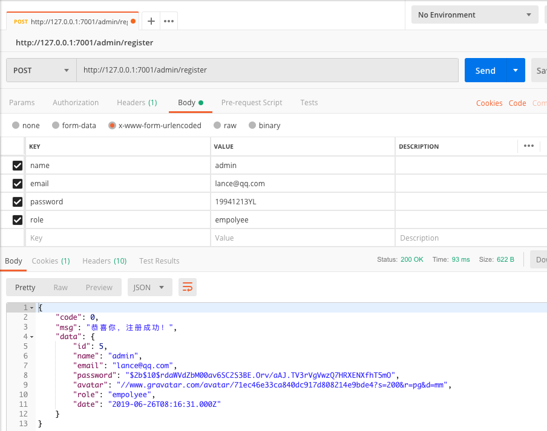
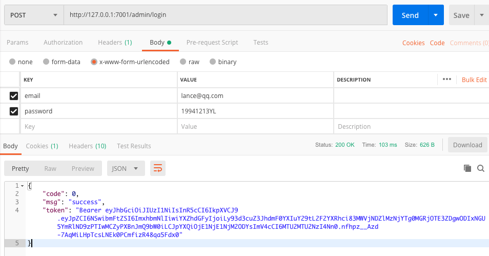
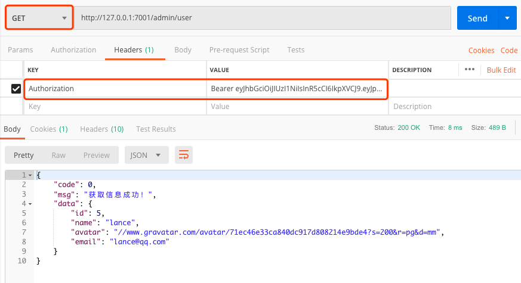
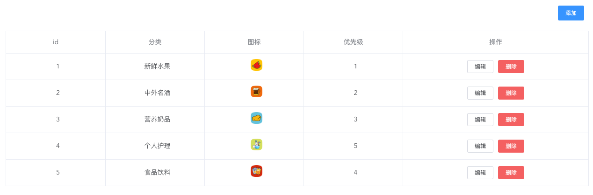

# 后端编写步骤

## 准备工作

### 安装 egg 并初始化项目

全局安装 egg （已经安装过的忽略）：

```shell
npm i egg-init -g
```

然后开始初始化项目：

```shell
mkdir sw-mall-admin && cd sw-mall-admin # 你可以换成自己的项目名
npm init egg --type=simple
npm i
```

p.s. 上述初始化过程请科学上网。而且有可能仍然失败，如果失败请多尝试几次。

初始化完成之后你会看到类似下面这段话：

```shell
...egg started on http://127.0.0.1:7001 (2335ms)
```

然后打开此网址你就会看到朴实的 `hi, egg` 字样。到此初始化项目工作已经完成。

### 安装与配置数据库

个人习惯于使用 mysql 数据库，而且 egg 也提供了插件供我们使用，所以为了方便，使用 egg-mysql 来对数据库进行操作，首先来安装它 [egg-mysql](https://github.com/eggjs/egg-mysql) ：

```shell
npm i egg-mysql
```

然后在 `config/plugin.js` 中开启插件：

```js
mysql: {
  enable: true,
  package: 'egg-mysql',
},
```

在 `config/config.default.js` 中配置数据库连接信息：

```js
// 配置数据库信息
config.mysql = {
  client: {
    host: '127.0.0.1', // 主机
    port: '8889', // 端口号（默认是3306）
    user: 'root', // 数据库用户名
    password: 'root', // 数据库密码
    database: 'sw-mall',  // 数据库名
  },
  app: true,  // 是否加载到 app 上，默认开启
  agent: false, // 是否加载到 agent 上，默认关闭
};
```

### 导入数据库文件

我已经把本地的数据库导出为 [sw-mall.sql](sw-mall.sql) 文件，需要各位自行导入到本地的 mysql 中。

#### 数据库结构

- admin 管理员表
- category 一二级分类表
- comments 用户评论表
- goods 商品表
- site_info 网站信息表
- user 用户表
- adverts 广告+banner

### 测试数据库连接

一切准备好后，我们现在可以上手写个简单的查询来测试数据库连接是否正常了。

#### 在 Service 层编写数据查询

首先在 `app` 目录下新建 `service` 文件夹，然后建立一个 `test.js` 文件键入下面代码：

```js
'use strict';

const Service = require('egg').Service;

class TestService extends Service {
  /**
   * 查询所有商品分类
   * @return {object} 分类列表
   */
  async findAll() {
    const results = await this.app.mysql.select('category');
    return { results };
  }
}

module.exports = TestService;
```

p.s. 如果不太明白 Service 层的作用，可以点击 [此处](https://eggjs.org/zh-cn/tutorials/mysql.html#service-%E5%B1%82) 查看官方文档。

#### 在 Controller 中获取 Service 数据

编辑 `app/controller/home.js` 文件，新建 test 测试方法：

```js
async test() {
  const { ctx } = this;
  const category = await ctx.service.test.findAll();
  ctx.body = category;
}
```

#### 配置路由

编辑 `app/router.js` 文件配置路由：

```js
// 表示当访问 127.0.0.1:7000/test 时，调用 controller/home.js 下的 test 方法
router.get('/test', controller.home.test);
```

完成上述步骤后可访问 `127.0.0.1:7000/test` 查看效果。如果一切正常，你将会得到下面的数据结构：

```json
{
  "results": [
    {
      "ID": 1,
      "MALL_CATEGORY_NAME": "新鲜水果",
      ...
    },
    ...
  ]
}
```

## 编写注册接口

### 在 Service 中编写查询方法

整个项目需要两套接口，一套是提供给用户使用的商城App，一套是提供给后台管理员使用的管理系统（PC），为了区分它们，我将后台部分的API接口全部放进 `service` 下的 `admin` 文件夹。

首先我们在 `app/service` 文件夹中新建 `admin` 文件夹，并在其中创建 `admin.js` 文件，这里负责从数据库中查询管理员相关的数据，例如 `findOne` 方法可以根据「email」找到符合条件的管理员。目前我们仅需要实现下列方法：

- findOne（根据邮箱查找目标管理员）
- add（添加一个新管理员）

具体代码见 `app/service/admin/admin.js` ，这里不再赘述。

### 安装 bcrypt 和 gravatar

存储密码很重要的一步就是加密，这里我们采用 [bcrypt](https://www.npmjs.com/package/bcrypt) ；同时我们的管理员表的字段中还包含一个 avatar 字段，我们采用 [gravatar](https://www.npmjs.com/package/gravatar)（[全球公认头像](https://cn.gravatar.com/)） 帮助我们获取或生成头像。

接下来我们安装它们：

```shell
npm i bcrypt gravatar
```

### 在 Controller 中编写注册逻辑

首先在 `controller` 文件夹下新建 `admin` 文件夹并创建 `admin.js`，然后在其中引入刚刚安装的两个包：

```js
const bcrypt = require('bcrypt');
const gravatar = require('gravatar');
```

接着在下方新建 `register` 方法编写注册逻辑：

```js
async register() {
  const { ctx } = this;
  ctx.body = ctx.request.body;
  // 判断邮箱是否已经注册过
  const admin = await ctx.service.admin.admin.findOne(ctx.body.email);
  if (user) {
    ctx.status = 400;
    ctx.body = {
      code: 0,
      message: '邮箱已被注册!',
    };
  } else {
    let { name, email, password, role } = ctx.body;
    // 加盐
    const salt = bcrypt.genSaltSync(10);
    // 根据用户输入密码来生成hash密码
    const hash = bcrypt.hashSync(password, salt);
    password = hash;
    // 获取/生成全球头像（当该邮箱从未注册过，返回一个默认头像，否则返回用户已经设置过的头像）
    const avatar = gravatar.url(email, {
      s: '200', r: 'pg', d: 'mm',
    });
    const result = await ctx.service.admin.admin.add({
      name, email, password, avatar, role,
    });
    if (result) {
      const { user } = await ctx.service.admin.admin.findOne(email);
      ctx.status = 200;
      ctx.body = {
        code: 0,
        message: '恭喜你，注册成功！',
        data: user,
      };
    } else {
      ctx.status = 200;
      ctx.body = {
        code: 1,
        message: '注册失败，请稍后重试',
      };
    }
  }
}
```

编写完成后使用 Postman 来测试接口：



大功告成~

## 编写登录接口

我们的登录接口采用 jwt 方案（不了解 jwt 是什么的，可以点击[此处](http://www.ruanyifeng.com/blog/2018/07/json_web_token-tutorial.html)查看阮一峰老师关于jwt的入门教程），首先来安装 jwt：

```shell
npm i jsonwebtoken
```

在 `app/controller/admin/user.js` 中引入：

```js
const bcrypt = require('bcrypt');
```

接着在该文件中创建 `login` 方法编写逻辑代码：

```js
async login() {
  const { ctx } = this;
  const { email, password } = ctx.request.body;
  // 根据email查找该管理员
  const user = await ctx.service.admin.admin.findOne(email);
  if (user) {
    const hashpwd = user.password;
    // 比对密码是否一致，一致则生成 token 登录成功
    await ctx.service.admin.admin.comparePassword(password, hashpwd).then(isMatch => {
      if (isMatch) {
        const { id, name, avatar, role } = user;
        const rule = { id, name, avatar, role };
        // jwt.sign('规则', '加密名字', '过期时间')
        const token = jwt.sign(rule, 'lance', { expiresIn: 3600 });
        ctx.status = 200;
        ctx.body = {
          code: 0,
          message: 'success',
          token: 'Bearer ' + token,
        };
      } else {
        ctx.status = 400;
        ctx.body = {
          code: 1,
          message: '登录失败，请检查用户名或密码是否填写正确！',
        };
      }
    }).catch(err => {
      ctx.status = 400;
      ctx.body = {
        code: 1,
        message: err,
      };
    });
  } else {
    ctx.status = 404;
    ctx.body = {
      code: 1,
      message: '用户不存在！',
    };
  }
}
```

上述代码可以用下面的伪代码概括：

```js
根据用户输入的邮箱在数据库中查找是否存在该管理员账户
如果存在：
  比较用户输入密码是否与数据库中存储的密码一致（利用bcrypt）
  如果一致：
    返回生成的jwt
  不一致：
    返回用户登录失败信息
不存在：
  返回用户不存在信息
```

完成登录接口的编写后，你可以访问 `127.0.0.1:7000/admin/login` 接口进行登录，登录成功后API会返回token给你，然后你就可以带着这个token来请求当前登录用户的个人数据了。请求个人数据的接口我们定义为 `admin/admin` ，该API接收一个 jwt ，当 jwt 存在并且没有过期时，该API返回用户的个人数据，下面我们就来编写这个接口。

## 使用 passport-jwt 验证 token 的有效性

接下来就是「登录鉴权」部分的逻辑处理，如果对 passport 不熟悉，可以点击[此处查看](https://eggjs.org/zh-cn/tutorials/passport.html#%E4%BD%BF%E7%94%A8-egg-passport) 了解它。

### 安装两个包

首先在命令行键入下面命令来安装包：

```shell
npm i egg-passport passport-jwt
```

### 配置并开启插件

然后在配置文件中声明启用：

> config/plugin.js

```js
passport: {
  enable: true,
  package: 'egg-passport',
},
passportJwt: {
  enable: true,
  package: 'passport-jwt',
},
```

### 挂载路由

接下来我们回到 `app/router.js` 中挂载 jwt ：

```js
module.exports = app => {
  const { router, controller } = app;
  const jwt = app.passport.authenticate('jwt', { session: false, successReturnToOrRedirect: null });
  // admin
  ...
  // 配置路由
  router.get('/admin/user', jwt, controller.admin.admin.user);
};
```

### 配置 passport-jwt

现在我们需要在项目根目录下新建 `app.js` 文件，然后配置并挂载jwt，最后通过 jwt_payload.id 去数据库里查询用户并返回：

```js
'use strict';

const JwtStrategy = require('passport-jwt').Strategy,
  ExtractJwt = require('passport-jwt').ExtractJwt;

const opts = {};
opts.jwtFromRequest = ExtractJwt.fromAuthHeaderAsBearerToken();
opts.secretOrKey = 'lance';

module.exports = app => {
  app.passport.use(new JwtStrategy(opts, (jwt_payload, done) => {
    app.mysql.get('admin', { id: jwt_payload.id }).then(user => {
      if (user) {
        console.log(user);
        return done(null, user);
      }
      return done(null, false);
    }).catch(err => console.log(err));
  }));
};
```

p.s. 想要了解更多 passport-jwt 的使用方法，可以点击[此处](https://www.npmjs.com/package/passport-jwt)查看。

至此，我们就完成了所有的配置。

### 在 Controller 中编写 admin 方法

最后我们就可以在 `app/controller/admin/admin.js` 文件下编写 `admin` 方法了：

```js
async admin() {
  const { ctx } = this;
  // 使用 ctx.isAuthenticated() 判断是否登录。
  if (ctx.isAuthenticated()) {
    const { id, name, avatar, email, role } = ctx.user;
    ctx.status = 200;
    ctx.body = {
      code: 0,
      message: '获取信息成功！',
      data: { id, name, avatar, email, role },
    };
  }
}
```

现在我们使用 Postman 来测试 `admin/admin` 这个 API 能否正常工作：

1. 首先通过 `admin/login` 接口获取 token：

  

2. 带着 token 请求 `admin/admin` 接口获取管理员个人信息：

  

搞定~

## 编写首页接口

首页主要展示4项信息：

- 商城总访问量
- 本周新注册用户
- 本周商品上新数量
- 销量前十的商品柱状图（EChartJS）

我们在 `app/controller/admin` 目录下新建 `site.js` 文件，用来编写首页信息返回的业务逻辑。同时在 `app/service/admin` 目录下新建 `site.js` 文件，用来编写访问数据库的代码。最后在 `app/router.js` 中编写路由。具体代码就不贴了，可以在上述各文件中查看~

## 编写一级分类接口

在最终的后台管理系统中，有关一级分类的功能从下方截图能够清晰看出：



无非老生常谈的增删改查，所以这里不进行展开说明，仅把与之相关的文件列出来，方便大家查看：

- 路由：`app/router.js`
- 控制器：`app/controller/admin/category.js`
- 服务层：`app/service/admin/category.js`

### 上传图片

其中category有个 image 字段需要我们能够提供图片的上传功能，这里着重讲一下。

首先在 `config/config.default.js` 中对上传的文件做一些配置：

```js
config.multipart = {
  fileSize: '1mb',
  mode: 'stream',
  fileExtensions: [
    '.jpg', '.jpeg', // image/jpeg
    '.png',
  ],
};
```

然后我们来设置上传的路由，在 `app/router.js` 中配置：

```js
router.post('/admin/form/upload', jwt, controller.admin.form.upload);
```

这样前端就可以通过 `localhost:7001/admin/form/upload` 这个接口上传图片了。

最后就是在 `app/controller/admin` 下新建 form.js 文件并编写代码了，但在写之前还要安装两个插件，一个是写入文件插件，另一个是出错关闭管道插件：

```shell
npm i await-stream-ready, stream-wormhole
```

安装完成后编写 Controller 代码：

```js
'use strict';
const Controller = require('egg').Controller;
// 文件存储
const fs = require('fs');
const path = require('path');
const awaitWriteStream = require('await-stream-ready').write;
const sendToWormhole = require('stream-wormhole');

class FormController extends Controller {
  async upload() {
    const ctx = this.ctx;
    const stream = await ctx.getFileStream();
    // 文件名: 随机数 + 时间戳 + 原文件后缀
    // path.extname(stream.filename).toLocaleLowerCase()为后缀名（.jpg,.png等）
    const filename = Math.random().toString(36).substring(2) + new Date().getTime() + path.extname(stream.filename).toLocaleLowerCase();
    // 图片存放在静态资源 public/admin/image 文件夹下
    const target = path.join(this.config.baseDir, 'app/public/admin/image', filename);
    // 生成一个文件写入 文件流
    const writeStream = fs.createWriteStream(target);
    try {
      // 异步把文件流 写入
      await awaitWriteStream(stream.pipe(writeStream));
    } catch (err) {
      // 如果出现错误，关闭管道
      await sendToWormhole(stream);
      throw err;
    }
    this.ctx.body = {
      code: 0,
      data: 'http://localhost:7001/public/admin/image/' + filename,
      msg: '上传成功',
    };
  }
}

module.exports = FormController;
```

TODO: 如果你还想了解前端部分的代码，可以[点击这里](https://github.com/evestorm/sw-mall-admin/blob/master/client/note.md#%E5%95%86%E5%93%81%E4%B8%80%E7%BA%A7%E5%88%86%E7%B1%BB%E7%9A%84%E5%A2%9E%E5%88%A0%E6%94%B9%E6%9F%A5)直达。

### 利用 extend 生成随机32位字符串

商品分类表中我们把「cate_id」设置为唯一标识，为了避免id重复，我们需要动态的为新分类生成一个32位的由数字和字母组成的cate_id，这里把该方法起名为 `getRandomStr` 放进 egg 的拓展功能中。

首先在 `app` 下新建 `extend` 文件夹，并在其中创建 `helper.js` ：

```js
'use strict';

// 外部可以通过 this.ctx.helper.getRandomStr() 调用
// 模板中通过 helper.getRandomStr() 调用
module.exports = {
  getRandomStr(len) {
    let str = '';
    for (let i = 0; i < len; i++) {
      str += Math.random().toString(36).substring(2);
    }
    return str.substring(0, len);
  },
};
```

最后在 `app/service/admin/category.js` 中调用：

```js
/**
 * 新增一个分类
 * @param {object} info 分类信息
 * @return {boolean} 是否成功
 */
async add(info) {
  // 生成随机32位「数字+字母」字符串
  const cate_id = this.ctx.helper.getRandomStr(32);
  const result = await this.app.mysql.insert('category', {
    cate_id, ...info,
  });
  return result.affectedRows === 1;
}
```

## 编写商品详情接口

这次我们来编写商品详情的接口，先从列表页开始，下面是前端页面展示效果：


和之前的一级分类接口一样，首先得配置路由，然后分别在 「Controller」和「Service」 中创建相应文件... 由于步骤类似就不展示代码了，自己可以在下面几个文件中查看：

- `app/controller/admin/goods.js`
- `app/service/admin/goods.js`
- `app/router.js`

相比一级分类接口的列表页，这次的商品列表页多了两个功能：「分页」和「筛选」，所以把这部分代码粘贴过来方便查看：

> app/controller/admin/goods.js

我们在控制器中接收前端传递过来的参数，然后扔给service去拼接sql字符串

```js
/**
 *  根据类别获取商品列表
 */
async getGoodsList() {
  const { ctx } = this;
  // 把前端的查询参数交给service
  // 并获取「符合条件的所有条数」以及「当前请求页的具体15条数据」
  const { allCount, results } = await ctx.service.admin.goods.findAllByFilter(ctx.query);
  if (results) {
    ctx.status = 200;
    ctx.body = {
      code: 0,
      message: '成功获取商品数据',
      data: {
        allCount,
        results,
      },
    };
  } else {
    ctx.status = 400;
    ctx.body = {
      code: 1,
      message: '查询失败，请稍后重试！',
    };
  }
}
```

> app/service/admin/goods.js

service 拿到 controller 传过来的参数后对 sql 语句进行拼接。这里要提一句，其实 egg 给我们封装了 egg-mysql 插件，可以很方便的进行[条件查询](https://eggjs.org/zh-cn/tutorials/mysql.html#read)，然而它没有提供「模糊」查询的接口，所以这里进行了sql语句拼接。

```js
/**
 * 查询符合条件的商品
 * @param {object} filter 前端传过来的参数
 * @return {object} 商品列表
 */
async findAllByFilter(filter) {
  // 子分类ID，请求页码，商品名称关键词，创建时间的区间
  const { SUB_ID, page = 1, keywords = '', stime = '', etime = '' } = filter;
  const start = (page - 1) * 15;

  let where = '';
  where += `WHERE SUB_ID = '${SUB_ID}'`;
  where += keywords !== '' ?
    ` AND NAME LIKE '%${keywords}%'` : '';
  where += stime !== '' && etime !== '' ?
    ` AND CREATE_TIME BETWEEN '${stime}' AND '${etime}'` : '';

  // 查询符合条件的总条数
  const allCount = await this.app.mysql.query(`SELECT COUNT(*) AS allCount FROM goods ${where}`);
  // 查询符合条件的15条
  const results = await this.app.mysql.query(
    `SELECT
      ID, SUB_ID, STATE, NAME, ORI_PRICE, PRESENT_PRICE, 
      AMOUNT, DETAIL, SALES_COUNT, IMAGE1, 
      CREATE_TIME, UPDATE_TIME 
    FROM goods ${where} LIMIT ${start}, 15`);
  return {
    allCount: allCount[0].allCount,
    results,
  };
}
```

至此我们的后台管理系统的接口就全部编写完毕了，接下来你可以[点击此处](./client/note.md)查看前端部分的编写过程。

## 提供客户端商城接口

### 首页

首页所需数据结构如下：

```json
{
  "data": {
    "adverts": {
      "image": "...",
      "link": "..."
    },
    "floorName": {
      "floor1": "休闲食品",
      "floor2": "新鲜水果",
      "floor3": "营养奶品"
    },
    "floor1": [{
      "goodsId": "...",
      "image": "..."
    },...],
    "floor2": [{
      "goodsId": "...",
      "image": "..."
    },...],
    "floor3": [{
      "goodsId": "...",
      "image": "..."
    },...],
    "slides": [{
      "image": "...",
      "goodsId": "..."
    },...],
    "hotGoods": [{
      "mallPrice": 3.90,
      "image": "...",
      "goodsId": "...",
      "price": 3.90,
      "name": "..."
    },...],
    "recommend": [{
      "image": "...",
      "mallPrice": 16.80,
      "goodsId": "...",
      "price": 16.80,
      "goodsName": "..."
    },...]
  }
}
```

创建 `app/service/adverts.js` 文件提供查询广告+banner数据的服务。

由于商品查询已经service文件已经在 `admin` 文件夹创建过了，所以手机端商城的查询服务也在 `app/service/admin/category.js` 中新增。具体代码在该文件中查看。

然后到 `app/controller/home.js` 文件中编写查询接口。

最后在 `app/router.js` 中配置首页查询接口：

```js
// 商城
router.get('/', controller.home.index);
router.get('/index', controller.home.index);
```

### 登录注册

商城的登录注册逻辑和后台管理系统的一样，只不过查询的表不同，这次是 `user` 表。具体代码见：

- `app/controller/user.js`
- `app/service/user.js`
- `app/router.js`

这里要提的一点是，为了判断前端的请求是由 `商城App` 发出的还是 `后台管理系统` 发出的，我们需要在 `app.js` 中做一层判断：

```js
module.exports = app => {
  app.on('request', ctx => {
    app.passport.use(new JwtStrategy(opts, (jwt_payload, done) => {
      // 鉴权后台管理系统
      if (ctx.request.url.indexOf('/admin') > -1) {
        app.mysql.get('admin', { id: jwt_payload.id }).then(user => {
          if (user) {
            return done(null, user);
          }
          return done(null, false);
        }).catch(err => console.log(err));
      } else { // 鉴权前台商城App
        app.mysql.get('user', { id: jwt_payload.id }).then(user => {
          if (user) {
            return done(null, user);
          }
          return done(null, false);
        }).catch(err => console.log(err));
      }
    }));
  });
};
```

## 优化

### sql防注入

在之前商品列表查询页中，我们后端mysql的语句采用了字符串拼接的方式，而这种方式容易导致sql注入，所以这里将改为每个?匹配一个参数的方式：

> app/service/admin/goods.js

```js
/**
 * 查询符合条件的商品
 * @param {object} filter 前端传过来的参数
 * @return {object} 商品列表
 */
async findAllByFilter(filter) {
  ...

  let where = '';
  const arr = [];

  where += 'WHERE SUB_ID = ?';
  arr.push(SUB_ID);
  if (keywords !== '') {
    where += " AND NAME LIKE CONCAT('%', ?, '%')";
    arr.push(keywords);
  }
  if (stime !== '' && etime !== '') {
    where += ' AND CREATE_TIME BETWEEN ? AND ?';
    arr.push(stime, etime);
  }

  // 查询符合条件的总条数
  const allCount = await this.app.mysql.query(`SELECT COUNT(*) AS allCount FROM goods ${where}`, arr);
  // 查询符合条件的15条
  const results = await this.app.mysql.query(
    `SELECT
      ID, SUB_ID, STATE, NAME, ORI_PRICE, PRESENT_PRICE, 
      AMOUNT, DETAIL, SALES_COUNT, IMAGE1, 
      IS_RECOMMEND, 
      CREATE_TIME, UPDATE_TIME 
    FROM goods ${where} LIMIT ${start}, 15`, arr);
  ...
}
```

## 上线

完成项目开发后我们还需要进行上线，这里有个操作务必要执行，那就是解决跨域问题。有小伙伴会说跨域问题不是已经在前端做了代理么解决了吗？为什么还要配置。这是因为前端的代理配置只适用于开发环境，vue项目通过 `npm run serve` 启动后是会在后台启一个node服务器的，api的请求是该服务器帮我们代为转发的，然而一旦我们把前端代码打包成静态资源，就没有“人”能帮我们代为转发了，所以还是会出现跨域问题。说完了为什么做，下面就是怎么做了。

首先下载 egg-cors 包：

```shell
npm i egg-cors
```

然后在 `config/plugin.js` 中设置开启cors：

```js
cors: {
  enable: true,
  package: 'egg-cors',
},
```

最后在 `config/config.default.js` 中配置：

```js
config.cors = {
  origin: 'http://mall.swlance.cn',
  credentials: true,
};
```

此时再上传我们整个项目，然后在服务器的该项目目录的终端下执行 `npm run dev` 就能开启服务，让前端正常请求道接口提供的数据了。

最后的最后，我们还需要对上传接口进行改造，还记得之前我们上传成功后返回给前端了一个图片路径吗？它被设置成了 "http://localhost:7001" 开头，这个链接如果直接单拎出来是无法访问到的，所以生产环境下我们需要把它替换成你自己的域名，修改代码如下：

```js
...
const baseURL = this.app.config.env === 'prod'
  ? 'http://mall.evelance.cn:7001/'
  : 'http://localhost:7001/';

this.ctx.body = {
  code: 0,
  data: `${baseURL}public/admin/image/${filename}`,
  msg: '上传成功',
};
```

最后在生产环境下，我们就不采用 `npm run dev` 来启动项目了，而改用：`egg_server_env=prod npm start`。

p.s. 前端代码的上线流程见 `client/note.md` 的最后部分。

## 资源

如果你想要了解如何购买服务器以及 nginx 配置情况，可以参考下面我的博客：

- [阿里云云服务器ECS购买与使用（笔记）](https://evestorm.github.io/posts/58410/)
- [ubuntu下nginx基本使用](https://evestorm.github.io/posts/36876/)
